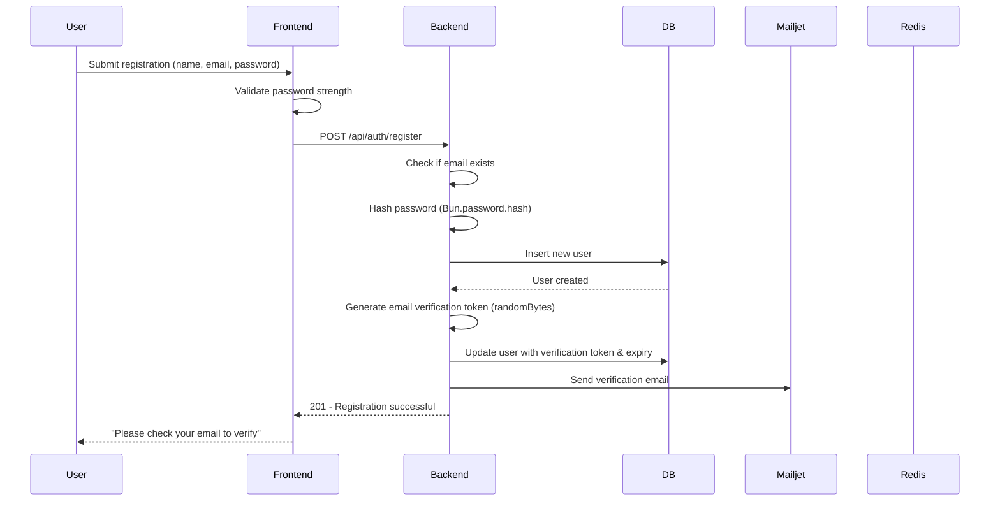
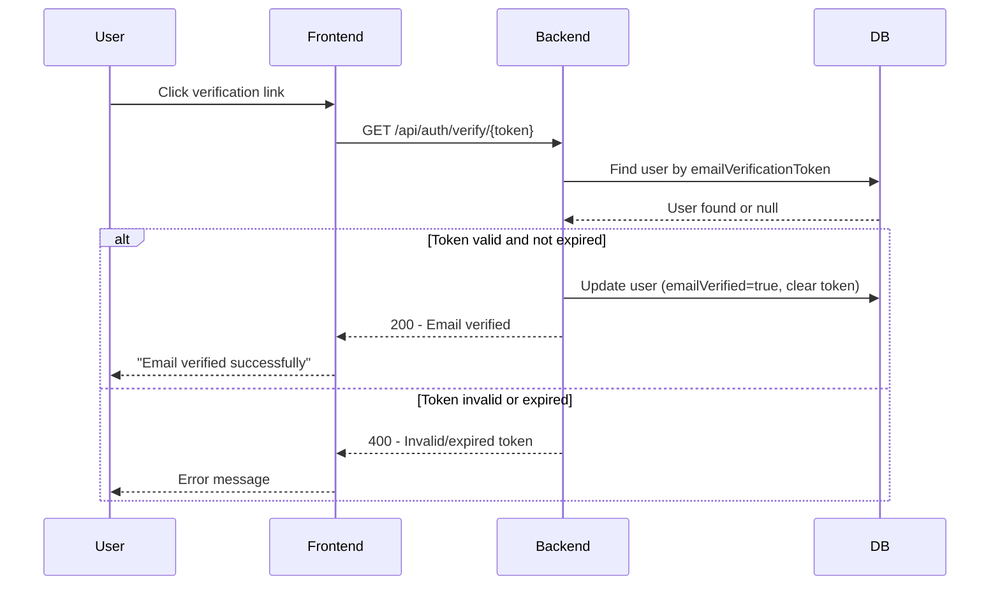
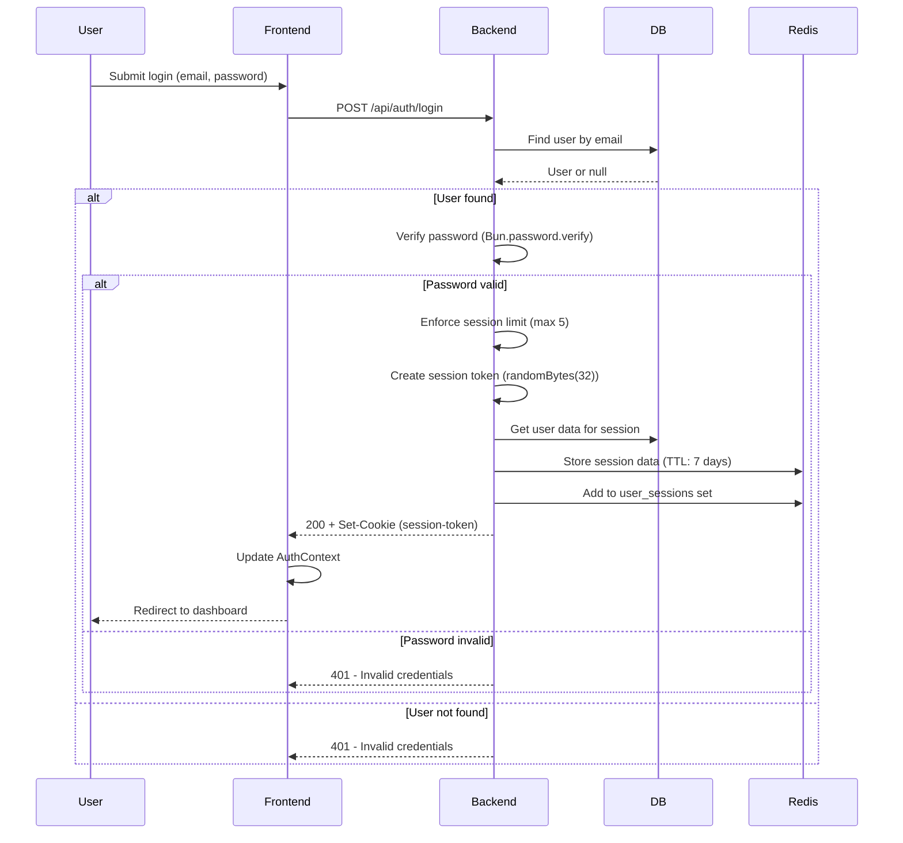
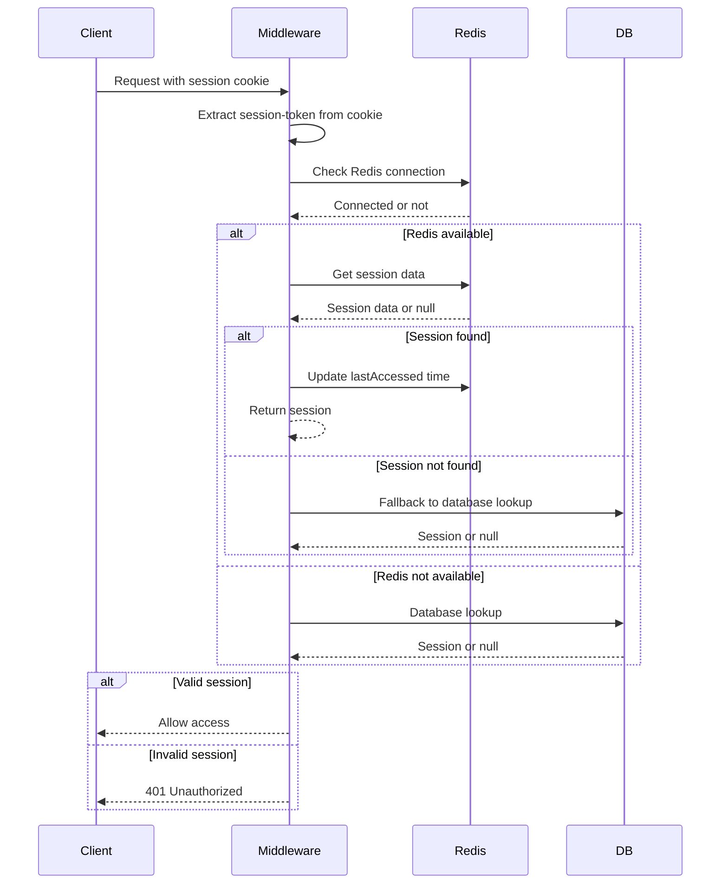
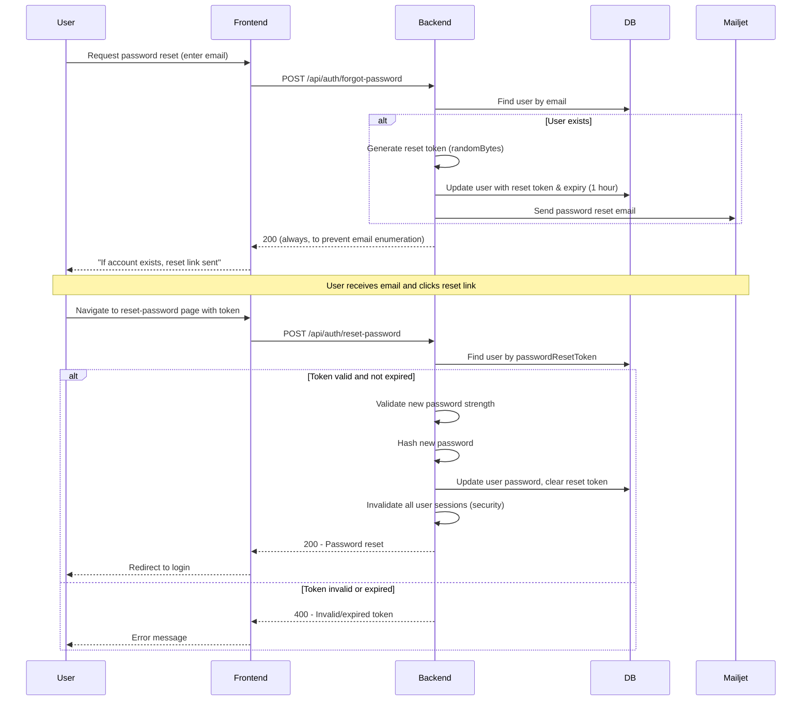

# Complete Authentication Flow Analysis

## Table of Contents
1. [Overview](#overview)
2. [Architecture Components](#architecture-components)
3. [Authentication Flows](#authentication-flows)
4. [Session Management](#session-management)
5. [Identified Issues](#identified-issues)
6. [Corrected Code](#corrected-code)

---

## Overview

This project implements a comprehensive authentication system with the following features:
- User registration with email verification
- Login/logout with session management
- Password reset via email
- Redis-based session storage with database fallback
- Session rotation and limit enforcement
- Email verification via Mailjet
- Protected routes with middleware

---

## Architecture Components

### Database Schema ([`schema.ts`](src/DB/schema.ts))

```typescript
usersTable {
  id: integer (auto-increment, primary key)
  name: varchar(255)
  age: integer (required, default 0)
  email: varchar(255) (unique, indexed)
  passwordHash: varchar(255)
  emailVerified: boolean (default false)
  emailVerificationToken: varchar(255) (indexed)
  emailVerificationExpires: timestamp
  passwordResetToken: varchar(255) (indexed)
  passwordResetExpires: timestamp
  createdAt: timestamp
  updatedAt: timestamp
}

sessionsTable {
  id: uuid (primary key)
  userId: integer (foreign key -> users.id, cascade delete)
  sessionToken: varchar(255) (unique, indexed)
  expiresAt: timestamp
  createdAt: timestamp
  lastAccessed: timestamp
}
```

### Redis Storage Structure

Redis is used as the primary session store with database fallback:

```
Redis Keys:
- session:{token}          -> JSON session data (TTL: 7 days)
- user_sessions:{userId}   -> Set of session tokens (TTL: 7 days)
- email_verification:{token} -> Verification token data
- password_reset:{token}   -> Password reset token data
```

### Frontend Components

- **AuthContext** ([`AuthContext.tsx`](src/FRONTEND/context/AuthContext.tsx)): React context for auth state management
- **API Service** ([`api.ts`](src/FRONTEND/services/api.ts)): HTTP client with retry logic and error handling
- **Auth Forms**: Login, Register, ForgotPassword, ResetPassword, VerifyEmail forms

---

## Authentication Flows

### 1. Registration Flow



**Key Implementation Details:**

1. **Password Validation** ([`password.ts`](src/BACKEND/auth/password.ts)):
   - Minimum 8 characters
   - At least 1 uppercase letter
   - At least 1 lowercase letter
   - At least 1 number

2. **Password Hashing** ([`register.ts`](src/BACKEND/routes/register.ts:48)):
   ```typescript
   const passwordHash = await Bun.password.hash(password);
   ```
   Uses Bun's built-in password hashing (argon2id by default)

3. **Email Verification Token** ([`email.ts`](src/BACKEND/auth/email.ts:71-84)):
   ```typescript
   const token = randomBytes(32).toString("hex"); // 64-character hex string
   expiresAt.setHours(expiresAt.getHours() + 24); // 24 hour expiry
   ```

4. **Email Sending** ([`email.ts`](src/BACKEND/auth/email.ts:254-263)):
   - Uses Mailjet API
   - Sends HTML and text versions
   - Includes verification link: `{FRONTEND_URL}/verify-email?token={token}`

---

### 2. Email Verification Flow



**Key Implementation Details:**

- Token lookup: [`verifyEmail.ts`](src/BACKEND/routes/verifyEmail.ts:21)
- Expiry check: [`verifyEmail.ts`](src/BACKEND/routes/verifyEmail.ts:32-36)
- User update: [`verifyEmail.ts`](src/BACKEND/routes/verifyEmail.ts:40-47)

---

### 3. Login Flow



**Key Implementation Details:**

1. **Password Verification** ([`login.ts`](src/BACKEND/routes/login.ts:37)):
   ```typescript
   const isPasswordValid = await Bun.password.verify(password, user[0]!.passwordHash);
   ```

2. **Session Creation** ([`session.ts`](src/BACKEND/auth/session.ts:92-149)):
   ```typescript
   const sessionToken = randomBytes(32).toString("hex"); // 64-character hex
   const sessionData = {
     userId,
     email,
     name,
     emailVerified,
     createdAt: new Date().toISOString(),
     lastAccessed: new Date().toISOString(),
   };
   await RedisUtils.setWithTTL(sessionKey, JSON.stringify(sessionData), ttl);
   await RedisUtils.sadd(userSessionsKey, sessionToken);
   ```

3. **Session Cookie** ([`login.ts`](src/BACKEND/routes/login.ts:51-54)):
   ```typescript
   Set-Cookie: session-token={token}; Path=/; HttpOnly; SameSite=Lax; Max-Age=604800
   ```

4. **Session Limit Enforcement** ([`session.ts`](src/BACKEND/auth/session.ts:11-63)):
   - Maximum 5 concurrent sessions per user
   - Oldest session is invalidated when limit is reached
   - Uses Redis sets to track user sessions

---

### 4. Session Validation Flow (Middleware)



**Key Implementation Details:**

1. **Middleware Function** ([`middleware.ts`](src/BACKEND/auth/middleware.ts:4-23)):
   ```typescript
   export const requireAuth = async (request: Request): Promise<{...} | Response>
   ```

2. **Session Validation** ([`session.ts`](src/BACKEND/auth/session.ts:169-214)):
   - Checks Redis first
   - Falls back to database if Redis unavailable or session not found
   - Updates `lastAccessed` timestamp on successful validation
   - Refreshes TTL on each access (sliding expiration)

---

### 5. Logout Flow

```mermaid
sequenceDiagram
    participant User
    participant Frontend
    participant Backend
    participant Redis
    participant DB

    User->>Frontend: Click logout
    Frontend->>Frontend: Call authApi.logout()
    Frontend->>Backend: POST /api/auth/logout
    Backend->>Backend: Extract session-token from cookie
    Backend->>Redis: Check Redis connection
    alt Redis available
        Backend->>Redis: Get session data (to get userId)
        Backend->>Redis: Remove from user_sessions set
        Backend->>Redis: Delete session key
    else Redis not available
        Backend->>DB: Delete session from database
    end
    Backend-->>Frontend: 200 + Set-Cookie (session-token=; Max-Age=0)
    Frontend->>Frontend: Clear user state in AuthContext
    Frontend-->>User: Redirect to login
```

**Key Implementation Details:**

1. **Session Invalidation** ([`session.ts`](src/BACKEND/auth/session.ts:267-301)):
   ```typescript
   export const invalidateSession = async (sessionToken: string): Promise<void>
   ```
   - Removes session from user's session set
   - Deletes session data
   - Falls back to database if Redis unavailable

2. **Cookie Clearing** ([`logout.ts`](src/BACKEND/routes/logout.ts:35)):
   ```typescript
   Set-Cookie: session-token=; Path=/; HttpOnly; SameSite=Strict; Max-Age=0
   ```

---

### 6. Password Reset Flow



**Key Implementation Details:**

1. **Reset Token Generation** ([`email.ts`](src/BACKEND/auth/email.ts:87-111)):
   ```typescript
   const token = randomBytes(32).toString("hex");
   expiresAt.setHours(expiresAt.getHours() + 1); // 1 hour expiry
   ```

2. **Email Enumeration Protection** ([`forgotPassword.ts`](src/BACKEND/routes/forgotPassword.ts:26-29)):
   - Always returns success, even if user doesn't exist
   - Prevents attackers from checking if emails are registered

3. **Session Invalidation on Reset** ([`resetPassword.ts`](src/BACKEND/routes/resetPassword.ts:75)):
   ```typescript
   await invalidateAllUserSessions(user[0]!.id);
   ```
   - All existing sessions are invalidated for security
   - Forces user to login with new password

4. **Password Hashing** ([`resetPassword.ts`](src/BACKEND/routes/resetPassword.ts:61-63)):
   ```typescript
   const passwordHash = await Bun.password.hash(newPassword, {
     algorithm: "argon2id"
   });
   ```

---

### 7. Session Rotation Flow

The project includes session rotation logic ([`sessionRotation.ts`](src/BACKEND/auth/sessionRotation.ts)):

```typescript
// Rotate session token periodically for security
export const rotateSession = async (oldSessionToken: string): Promise<string | null>
```

This creates a new session token while preserving session data, helping prevent session fixation attacks.

---

## Session Management

### Redis Session Storage

**Primary Storage (Redis):**
```
session:{token} -> {
  "userId": 123,
  "email": "user@example.com",
  "name": "John Doe",
  "emailVerified": true,
  "createdAt": "2024-01-15T10:30:00.000Z",
  "lastAccessed": "2024-01-15T11:30:00.000Z"
}
TTL: 7 days (604800 seconds)

user_sessions:{userId} -> Set of session tokens
TTL: 7 days (604800 seconds)
```

**Fallback Storage (Database):**
```
sessionsTable:
- id: uuid
- userId: integer
- sessionToken: varchar(255)
- expiresAt: timestamp
- createdAt: timestamp
- lastAccessed: timestamp
```

### Session Limit Enforcement

The system enforces a maximum of 5 concurrent sessions per user:

1. When creating a new session, the system checks the current count
2. If at the limit, the oldest session is invalidated
3. Oldest is determined by `createdAt` timestamp
4. Works with both Redis and database storage

### Redis Utilities ([`redis.ts`](src/BACKEND/redis.ts))

```typescript
RedisUtils = {
  setWithTTL(key, value, ttl)     // Set key with expiration
  get(key)                         // Get key value
  del(key)                         // Delete key
  sadd(key, member)                // Add to set
  srem(key, member)                // Remove from set
  smembers(key)                    // Get all set members
  expire(key, ttl)                 // Set expiration
  exists(key)                      // Check if key exists
  sessionKey(token)                // Format: "session:{token}"
  userSessionsKey(userId)          // Format: "user_sessions:{userId}"
  emailVerificationKey(token)      // Format: "email_verification:{token}"
  passwordResetKey(token)          // Format: "password_reset:{token}"
}
```

---

## Identified Issues

### Issue 1: Lines 125-127 - No Direct Issues Found

The code at lines 125-127 in [`session.ts`](src/BACKEND/auth/session.ts:125-127):

```typescript
const sessionKey = RedisUtils.sessionKey(sessionToken);
const userSessionsKey = RedisUtils.userSessionsKey(userId);
```

**Analysis:**
- Both `sessionToken` and `userId` variables exist and are properly defined
- `RedisUtils.sessionKey()` and `RedisUtils.userSessionsKey()` methods exist and are correctly implemented
- No syntax errors or type mismatches

**Verdict:** No issues detected in these specific lines.

---

### Issue 2: Date String Comparison Bug (Line 33)

**Location:** [`session.ts`](src/BACKEND/auth/session.ts:33)

**Code:**
```typescript
if (!oldestSessionTime || sessionData.createdAt < oldestSessionTime) {
```

**Problem:**
The variable `oldestSessionTime` is initialized as `string | null` (line 24), but the comparison `sessionData.createdAt < oldestSessionTime` compares strings lexicographically. While ISO8601 date strings are lexicographically sortable, this is fragile and could break if the date format changes.

**Impact:**
- Could lead to incorrect oldest session identification
- May cause wrong session to be invalidated when enforcing session limits

**Fix:**
```typescript
// Convert to Date objects for proper comparison
if (!oldestSessionTime || new Date(sessionData.createdAt) < new Date(oldestSessionTime)) {
```

---

### Issue 3: Variable Declaration Scope Issue (Lines 32, 276, 278)

**Location:** [`session.ts`](src/BACKEND/auth/session.ts:32, 276, 278)

**Code:**
```typescript
// Line 32
let sessionData;
// Line 276-278
let sessionData;
try {
  sessionData = JSON.parse(sessionDataStr);
```

**Problem:**
The `sessionData` variable is declared with `let` without a type annotation. This makes it implicitly `any`, which defeats TypeScript's type safety.

**Impact:**
- Loss of type safety
- Potential runtime errors if sessionData is used incorrectly
- Makes code harder to maintain

**Fix:**
```typescript
// Line 32
let sessionData: { userId: number; createdAt: string } | null = null;

// Line 276-278
let sessionData: { userId: number } | null = null;
try {
  sessionData = JSON.parse(sessionDataStr);
```

---

### Issue 4: Inconsistent Session Data Structure Between Redis and Database

**Location:** [`session.ts`](src/BACKEND/auth/session.ts:152-167)

**Code:**
```typescript
const createDatabaseSession = async (userId: number, sessionToken: string, sessionData: any): Promise<string> => {
  try {
    await db.insert(sessionsTable).values({
      id: randomBytes(16).toString("hex"),
      userId,
      sessionToken,
      expiresAt: new Date(Date.now() + 7 * 24 * 60 * 60 * 1000),
      createdAt: new Date(),
      lastAccessed: new Date(),
    });
    return sessionToken;
  }
```

**Problem:**
The `sessionData` parameter is accepted but never used. The database session only stores minimal information (userId, token, timestamps), while Redis stores full user data (email, name, emailVerified). This creates an inconsistency where:
- Redis sessions contain full user data
- Database sessions only contain userId
- When falling back to database validation, additional DB queries are needed to get user data

**Impact:**
- Inconsistent behavior between Redis and database storage
- Additional database queries when using database fallback
- Potential performance degradation

**Fix:**
Either store full session data in database or document the inconsistency clearly.

---

### Issue 5: Missing Error Handling for Redis Connection Failures in createSession

**Location:** [`session.ts`](src/BACKEND/auth/session.ts:130-146)

**Code:**
```typescript
if (redisAvailable) {
  try {
    await RedisUtils.setWithTTL(sessionKey, JSON.stringify(sessionData), ttl);
    await RedisUtils.sadd(userSessionsKey, sessionToken);
    await RedisUtils.expire(userSessionsKey, ttl);
  } catch (error) {
    console.error("Error creating session in Redis:", error);
    return await createDatabaseSession(userId, sessionToken, sessionData);
  }
} else {
  return await createDatabaseSession(userId, sessionToken, sessionData);
}
```

**Problem:**
If Redis fails during `sadd` or `expire` after `setWithTTL` succeeds, the session data is orphaned in Redis (exists but not in user's session set). The fallback to database creates a duplicate session.

**Impact:**
- Orphaned Redis sessions that won't be cleaned up
- Memory leaks in Redis
- Inconsistent session state

**Fix:**
Use a transaction or ensure atomicity, or clean up on failure.

---

### Issue 6: SameSite Cookie Attribute Inconsistency

**Location:** [`login.ts`](src/BACKEND/routes/login.ts:52) vs [`logout.ts`](src/BACKEND/routes/logout.ts:35)

**Code:**
```typescript
// login.ts line 52
"Set-Cookie",
`session-token=${sessionToken}; Path=/; HttpOnly; SameSite=Lax; Max-Age=${7 * 24 * 60 * 60}`

// logout.ts line 35
headers.set("Set-Cookie", "session-token=; Path=/; HttpOnly; SameSite=Strict; Max-Age=0");
```

**Problem:**
Login uses `SameSite=Lax` but logout uses `SameSite=Strict`. This inconsistency could cause issues with cookie clearing.

**Impact:**
- Potential issues with logout in certain browser contexts
- Inconsistent security posture

**Fix:**
Use the same `SameSite` attribute consistently (recommend `Lax` for better UX).

---

### Issue 7: Missing Session Data Validation

**Location:** [`session.ts`](src/BACKEND/auth/session.ts:184-191)

**Code:**
```typescript
try {
  sessionData = JSON.parse(sessionDataStr);
} catch (parseError) {
  console.error("Error parsing session data:", parseError);
  await RedisUtils.del(sessionKey);
  return null;
}
```

**Problem:**
After parsing, there's no validation that the session data has the expected structure. If the data is malformed but parseable JSON, it could cause runtime errors.

**Impact:**
- Potential runtime errors when accessing sessionData properties
- Security risk if malicious data is stored in Redis

**Fix:**
Add validation schema for session data.

---

### Issue 8: Email Verification Token Not Stored in Redis

**Location:** [`email.ts`](src/BACKEND/auth/email.ts:71-84)

**Code:**
```typescript
export const createEmailVerificationToken = async (userId: number): Promise<string> => {
  const token = generateEmailVerificationToken();
  const expiresAt = new Date();
  expiresAt.setHours(expiresAt.getHours() + 24);
  
  await db
    .update(usersTable)
    .set({
      emailVerificationToken: token,
      emailVerificationExpires: expiresAt,
    })
    .where(eq(usersTable.id, userId));
    
  return token;
};
```

**Problem:**
The RedisUtils defines `emailVerificationKey` helper but it's never used. Email verification tokens are only stored in the database, not Redis.

**Impact:**
- Missed opportunity for performance optimization
- Inconsistent with password reset tokens (which also only use DB)

**Fix:**
Either use Redis for verification tokens or remove the unused helper.

---

### Issue 9: Password Hashing Algorithm Inconsistency

**Location:** [`register.ts`](src/BACKEND/routes/register.ts:48) vs [`resetPassword.ts`](src/BACKEND/routes/resetPassword.ts:61-63)

**Code:**
```typescript
// register.ts line 48
const passwordHash = await Bun.password.hash(password);

// resetPassword.ts line 61-63
const passwordHash = await Bun.password.hash(newPassword, {
  algorithm: "argon2id"
});
```

**Problem:**
Registration uses default hashing algorithm while password reset explicitly specifies `argon2id`. This could lead to different hash formats being stored.

**Impact:**
- Inconsistent password hash formats
- Potential issues if default algorithm changes in future Bun versions
- Harder to migrate password hashes

**Fix:**
Use explicit algorithm specification consistently.

---

### Issue 10: Missing Rate Limiting

**Location:** All auth routes

**Problem:**
There's no rate limiting on authentication endpoints (login, register, forgot-password, reset-password). This makes the system vulnerable to:
- Brute force attacks on login
- Email bombing attacks on registration
- DoS attacks via password reset requests

**Impact:**
- Security vulnerability
- Potential abuse of email service
- Increased costs for Mailjet usage

**Fix:**
Implement rate limiting middleware.

---

### Issue 11: Frontend User Refresh Caching Issue

**Location:** [`AuthContext.tsx`](src/FRONTEND/context/AuthContext.tsx:50-73)

**Code:**
```typescript
const refreshUser = useCallback(async (force = false) => {
  const now = Date.now();
  if (!force && lastRefresh && (now - lastRefresh) < 5 * 60 * 1000) {
    return;
  }
  // ...
}, [lastRefresh]);
```

**Problem:**
The 5-minute cache could cause stale user data. If user's email is verified or profile is updated, the frontend won't reflect changes until the cache expires.

**Impact:**
- Poor user experience
- Users may not see their verified status immediately
- Potential confusion

**Fix:**
Implement proper cache invalidation or reduce cache time.

---

### Issue 12: Missing CSRF Protection

**Location:** All POST endpoints

**Problem:**
There's no CSRF (Cross-Site Request Forgery) protection. Since cookies are used for authentication, the application is vulnerable to CSRF attacks.

**Impact:**
- Security vulnerability
- Attackers could perform actions on behalf of authenticated users

**Fix:**
Implement CSRF tokens or use SameSite=Strict cookies.

---

## Corrected Code

### Fix 1: Date Comparison Bug (session.ts line 33)

```typescript
// Before:
if (!oldestSessionTime || sessionData.createdAt < oldestSessionTime) {

// After:
if (!oldestSessionTime || new Date(sessionData.createdAt) < new Date(oldestSessionTime)) {
```

### Fix 2: Variable Declaration Type Annotations (session.ts)

```typescript
// Line 24-35 - Before:
let oldestSessionToken: string | null = null;
let oldestSessionTime: string | null = null;

for (const sessionToken of userSessions) {
  const sessionKey = RedisUtils.sessionKey(sessionToken);
  const sessionDataStr = await RedisUtils.get(sessionKey);
  
  if (sessionDataStr) {
    try {
      const sessionData = JSON.parse(sessionDataStr);
      if (!oldestSessionTime || sessionData.createdAt < oldestSessionTime) {
        oldestSessionTime = sessionData.createdAt;
        oldestSessionToken = sessionToken;
      }
    } catch (parseError) {
      // ...
    }
  }
}

// After:
let oldestSessionToken: string | null = null;
let oldestSessionTime: Date | null = null;

for (const sessionToken of userSessions) {
  const sessionKey = RedisUtils.sessionKey(sessionToken);
  const sessionDataStr = await RedisUtils.get(sessionKey);
  
  if (sessionDataStr) {
    try {
      const sessionData = JSON.parse(sessionDataStr) as {
        userId: number;
        createdAt: string;
      };
      const sessionCreatedAt = new Date(sessionData.createdAt);
      if (!oldestSessionTime || sessionCreatedAt < oldestSessionTime) {
        oldestSessionTime = sessionCreatedAt;
        oldestSessionToken = sessionToken;
      }
    } catch (parseError) {
      console.error("Error parsing session data during limit enforcement:", parseError);
      await RedisUtils.del(sessionKey);
      await RedisUtils.srem(userSessionsKey, sessionToken);
    }
  }
}
```

### Fix 3: SameSite Cookie Consistency (logout.ts)

```typescript
// Before:
headers.set("Set-Cookie", "session-token=; Path=/; HttpOnly; SameSite=Strict; Max-Age=0");

// After:
headers.set("Set-Cookie", "session-token=; Path=/; HttpOnly; SameSite=Lax; Max-Age=0");
```

### Fix 4: Password Hashing Consistency (register.ts)

```typescript
// Before:
const passwordHash = await Bun.password.hash(password);

// After:
const passwordHash = await Bun.password.hash(password, {
  algorithm: "argon2id"
});
```

### Fix 5: Session Data Validation (session.ts)

```typescript
// Add type definition for session data
interface SessionData {
  userId: number;
  email: string;
  name: string;
  emailVerified: boolean;
  createdAt: string;
  lastAccessed: string;
}

// In validateSession function (line 184-191):
let sessionData: SessionData | null = null;
try {
  sessionData = JSON.parse(sessionDataStr) as SessionData;
  
  // Validate session data structure
  if (!sessionData || 
      typeof sessionData.userId !== 'number' ||
      typeof sessionData.email !== 'string' ||
      typeof sessionData.name !== 'string' ||
      typeof sessionData.emailVerified !== 'boolean' ||
      typeof sessionData.createdAt !== 'string' ||
      typeof sessionData.lastAccessed !== 'string') {
    throw new Error('Invalid session data structure');
  }
} catch (parseError) {
  console.error("Error parsing session data:", parseError);
  await RedisUtils.del(sessionKey);
  return null;
}
```

---

## Summary

The authentication system is well-architected with:
- ✅ Redis-first session storage with database fallback
- ✅ Email verification workflow
- ✅ Password reset functionality
- ✅ Session limit enforcement
- ✅ Clean separation of concerns

However, there are several areas for improvement:
- ⚠️ Date comparison bug in session rotation
- ⚠️ Missing type annotations for session data
- ⚠️ Inconsistent cookie attributes
- ⚠️ Missing rate limiting
- ⚠️ No CSRF protection
- ⚠️ Inconsistent password hashing algorithms

The code at lines 125-127 specifically has no issues - the problems are in related code that affects the overall authentication flow.
