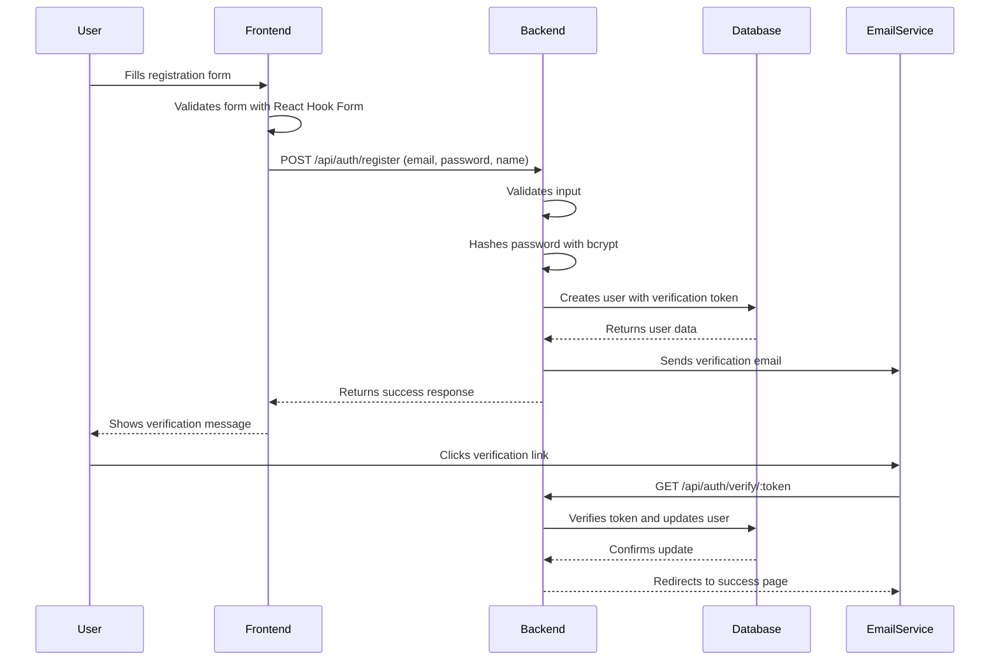
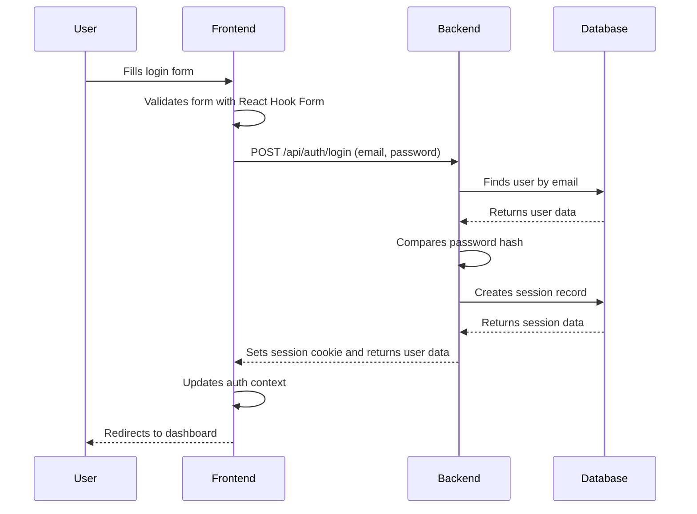
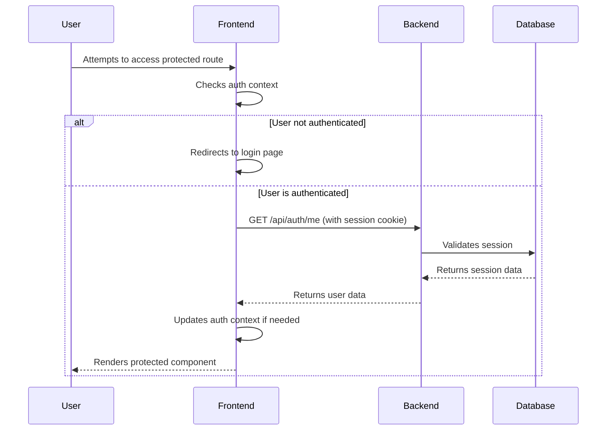
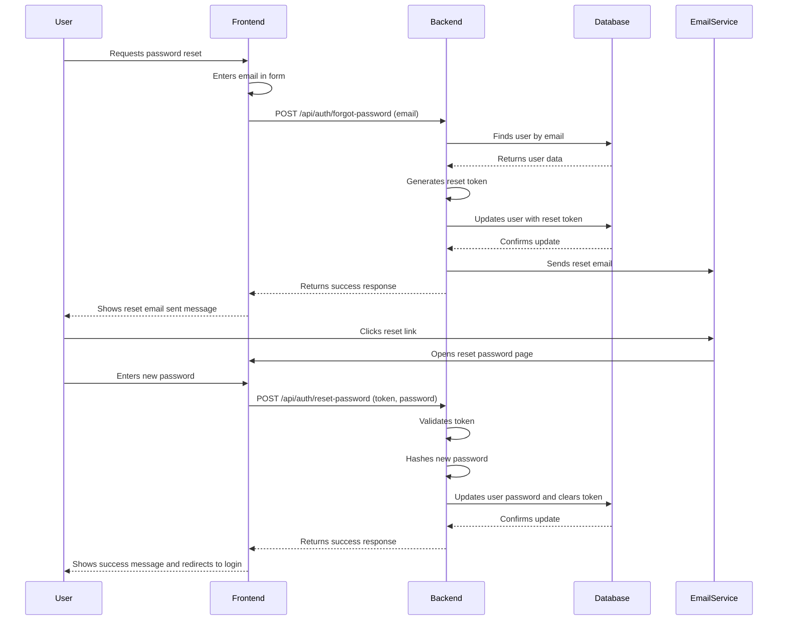
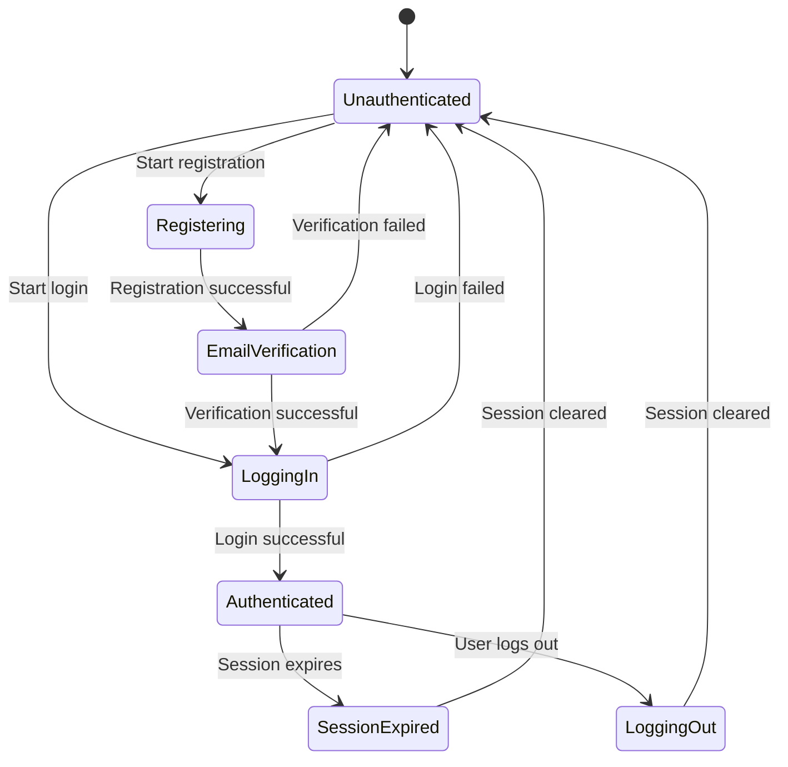

# Authentication Flow Diagram

## User Registration Flow



## User Login Flow



## Protected Route Access Flow



## Password Reset Flow



## Session Management Flow



## Database Schema Relationships

```mermaid
erDiagram
    USERS {
        int id PK
        varchar name
        varchar email UK
        varchar password_hash
        boolean email_verified
        varchar email_verification_token
        timestamp email_verification_expires
        varchar password_reset_token
        timestamp password_reset_expires
        timestamp created_at
        timestamp updated_at
    }
    
    SESSIONS {
        uuid id PK
        int user_id FK
        varchar session_token UK
        timestamp expires_at
        timestamp created_at
        timestamp last_accessed
    }
    
    USERS ||--o{ SESSIONS: has