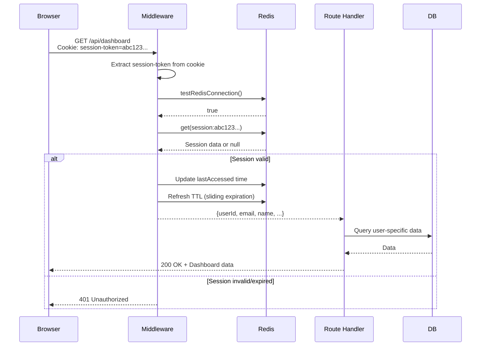
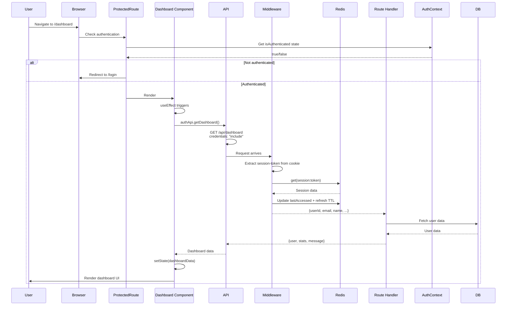

# Session-Based Authentication Explained

## Table of Contents
1. [How Session-Based Auth Works](#how-session-based-auth-works)
2. [The Complete Request Flow](#the-complete-request-flow)
3. [How the Server Knows It's You](#how-the-server-knows-its-you)
4. [Building a Protected Dashboard](#building-a-protected-dashboard)
5. [Security Considerations](#security-considerations)

---

## How Session-Based Auth Works

Session-based authentication works like a **temporary ID card** that you carry with you. Here's the analogy:

```
┌─────────────────────────────────────────────────────────────┐
│                    REAL WORLD ANALOGY                      │
├─────────────────────────────────────────────────────────────┤
│ 1. You go to a secure building (your website)          │
│ 2. Security guard asks for ID (login page)              │
│ 3. You show your driver's license (email + password)     │
│ 4. Guard verifies your ID, gives you a visitor badge      │
│    (this badge = session token in a cookie)               │
│ 5. You enter the building, badge visible on your chest    │
│ 6. Every time you approach a secure area (protected      │
│    route), guards check your badge                         │
│ 7. Badge expires after 7 days, you need new one         │
└─────────────────────────────────────────────────────────────┘
```

### Key Components

| Component | What It Does | Where It Lives |
|-----------|--------------|----------------|
| **Session Token** | Unique identifier for your session | Generated on login (64-char hex string) |
| **Cookie** | Stores the session token in browser | Browser (HttpOnly, SameSite=Lax) |
| **Redis** | Stores session data (user info, timestamps) | Server-side (fast key-value store) |
| **Middleware** | Validates session on each request | Server-side (before route handler) |

---

## The Complete Request Flow

### 1. Login Flow

```mermaid
sequenceDiagram
    participant Browser
    participant Server
    participant Redis
    participant DB

    Browser->>Server: POST /api/auth/login<br/>{email, password}
    Server->>DB: Find user by email
    DB-->>Server: User record
    Server->>Server: Verify password hash
    Server->>Redis: Check session limit
    Server->>Server: Generate session token<br/>(randomBytes(32).hex)
    Server->>DB: Get user data for session
    Server->>Redis: Store session data<br/>session:{token} → {userId, email, name, ...}
    Server->>Redis: Add to user's session set<br/>user_sessions:{userId} → {token1, token2, ...}
    Server-->>Browser: 200 OK + Set-Cookie<br/>session-token=abc123...; HttpOnly; SameSite=Lax
    Browser->>Browser: Store cookie automatically
```

**What happens on login:**

1. **User submits credentials** → POST to `/api/auth/login`
2. **Server finds user** → Query database by email
3. **Server verifies password** → Compare with stored hash using `Bun.password.verify()`
4. **Server enforces session limit** → Max 5 sessions per user
5. **Server generates session token** → `randomBytes(32).toString("hex")` (64 characters)
6. **Server stores session in Redis**:
   ```redis
   session:abc123def456... = {
     "userId": 123,
     "email": "user@example.com",
     "name": "John Doe",
     "emailVerified": true,
     "createdAt": "2024-01-15T10:30:00.000Z",
     "lastAccessed": "2024-01-15T10:30:00.000Z"
   }
   TTL: 604800 seconds (7 days)
   ```
7. **Server adds to user's session set**:
   ```redis
   user_sessions:123 = {abc123..., xyz789..., ...}
   ```
8. **Server sets cookie** → Browser automatically stores it

### 2. Accessing Protected Route Flow



**What happens on each protected request:**

1. **Browser sends request** → Automatically includes cookie with session token
2. **Middleware intercepts** → [`requireAuth()`](src/BACKEND/auth/middleware.ts:4) function runs first
3. **Middleware extracts token** → From `Cookie: session-token=abc123...` header
4. **Middleware validates session** → Calls [`validateSession()`](src/BACKEND/auth/session.ts:147)
5. **Redis lookup** → `get(session:abc123...)`
6. **If valid**:
   - Update `lastAccessed` timestamp
   - Refresh TTL (7 days from now)
   - Return session data to route handler
7. **If invalid** → Return 401 Unauthorized

### 3. Logout Flow

```mermaid
sequenceDiagram
    participant Browser
    participant Server
    participant Redis

    Browser->>Server: POST /api/auth/logout
    Server->>Server: Extract session-token from cookie
    Server->>Redis: get(session:abc123...) to get userId
    Server->>Redis: srem(user_sessions:123, abc123...)
    Server->>Redis: del(session:abc123...)
    Server-->>Browser: 200 OK + Set-Cookie<br/>session-token=; Max-Age=0
    Browser->>Browser: Delete cookie
```

---

## How the Server Knows It's You

### The Magic of Cookies

Cookies are automatically sent by the browser on every request to the same domain. Here's how it works:

```javascript
// Browser automatically does this (you don't write this code)
// Every request to yourdomain.com includes:

GET /api/dashboard HTTP/1.1
Host: yourdomain.com
Cookie: session-token=abc123def456789...  // ← Browser adds this automatically!
```

### Step-by-Step: From Browser to Server

#### 1. Login - Getting Your Badge

**Frontend ([`api.ts`](src/FRONTEND/services/api.ts:135-136)):**
```typescript
export const authApi = {
  login: (email: string, password: string) =>
    apiClient.post("/api/auth/login", { email, password }),
}
```

**Backend ([`login.ts`](src/BACKEND/routes/login.ts:46-54)):**
```typescript
// Create session
const sessionToken = await createSession(user[0]!.id);

// Set session cookie
const headers = new Headers();
headers.set("Content-Type", "application/json");
headers.set(
  "Set-Cookie",
  `session-token=${sessionToken}; Path=/; HttpOnly; SameSite=Lax; Max-Age=${7 * 24 * 60 * 60}`
);
```

**What the browser receives:**
```http
HTTP/1.1 200 OK
Content-Type: application/json
Set-Cookie: session-token=abc123def456...; Path=/; HttpOnly; SameSite=Lax; Max-Age=604800

{"message": "Login successful", "user": {...}}
```

**Browser automatically stores the cookie** - you don't need to do anything!

#### 2. Making Requests - Showing Your Badge

**Frontend ([`api.ts`](src/FRONTEND/services/api.ts:68)):**
```typescript
export const apiRequest = async <T = any>(
  endpoint: string,
  options: RequestInit = {},
  timeout: number = API_CONFIG.DEFAULT_TIMEOUT
): Promise<T> => {
  const url = `${API_CONFIG.BASE_URL}${endpoint}`;
  
  const response = await fetch(url, {
    headers: {
      "Content-Type": "application/json",
      ...options.headers,
    },
    credentials: "include",  // ← This is CRITICAL! Includes cookies
    signal: controller.signal,
    ...options,
  });
  // ...
}
```

**What `credentials: "include"` does:**
- Tells browser to send cookies with this request
- Works with `HttpOnly` cookies (JavaScript can't read them, but they're sent)
- Essential for session-based auth

#### 3. Server Validation - Checking Your Badge

**Middleware ([`middleware.ts`](src/BACKEND/auth/middleware.ts:4-23)):**
```typescript
export const requireAuth = async (request: Request): Promise<{...} | Response> => {
  const cookieHeader = request.headers.get("cookie");
  if (!cookieHeader) {
    return createErrorResponse("Unauthorized: No session cookie", 401, getSecurityHeaders());
  }
  
  const cookies = parseCookies(cookieHeader);
  const sessionToken = cookies["session-token"];  // ← Extract token
  
  if (!sessionToken) {
    return createErrorResponse("Unauthorized: No session token", 401, getSecurityHeaders());
  }
  
  const session = await validateSession(sessionToken);  // ← Check Redis
  if (!session) {
    return createErrorResponse("Unauthorized: Invalid session", 401, getSecurityHeaders());
  }
  
  return session;  // ← Return user data to route handler
};
```

**Session Validation ([`session.ts`](src/BACKEND/auth/session.ts:147-199)):**
```typescript
export const validateSession = async (sessionToken: string): Promise<{...} | null> => {
  const redisAvailable = await testRedisConnection();
  if (!redisAvailable) {
    return null;
  }

  try {
    const sessionKey = RedisUtils.sessionKey(sessionToken);
    const sessionDataStr = await RedisUtils.get(sessionKey);  // ← Redis lookup
    
    if (!sessionDataStr) {
      return null;  // Session doesn't exist or expired
    }
    
    let sessionData: SessionData | null = null;
    try {
      sessionData = JSON.parse(sessionDataStr) as SessionData;
      
      // Validate session data structure
      if (!sessionData || typeof sessionData.userId !== 'number' || ...) {
        throw new Error('Invalid session data structure');
      }
    } catch (parseError) {
      console.error("Error parsing session data:", parseError);
      await RedisUtils.del(sessionKey);  // Clean up malformed session
      return null;
    }
    
    // Update last accessed time (sliding expiration)
    sessionData.lastAccessed = new Date().toISOString();
    const ttl = 7 * 24 * 60 * 60;  // 7 days
    await RedisUtils.setWithTTL(sessionKey, JSON.stringify(sessionData), ttl);
    
    return {
      userId: sessionData.userId,
      email: sessionData.email,
      name: sessionData.name,
      emailVerified: sessionData.emailVerified,
      createdAt: sessionData.createdAt,
    };
  } catch (error) {
    console.error("Error validating session:", error);
    return null;
  }
};
```

### Why This Is Secure

| Security Feature | How It Works |
|-----------------|---------------|
| **HttpOnly Cookie** | JavaScript cannot read the cookie (prevents XSS attacks) |
| **SameSite=Lax** | Cookie only sent with same-site requests (prevents CSRF) |
| **Session Token in Redis** | Server-side storage, not exposed to client |
| **Sliding Expiration** | Session extends while active (7 days from last access) |
| **Session Limit** | Max 5 sessions per user (prevents abuse) |
| **Password Hashing** | Argon2id algorithm (slow, resistant to brute force) |

---

## Building a Protected Dashboard

### Backend: Creating a Protected Route

Here's how to create a protected dashboard endpoint:

#### Step 1: Create the Route Handler

**File: `src/BACKEND/routes/dashboard.ts`**
```typescript
import { requireAuth } from "../auth/middleware";
import { db } from "../../index";
import { usersTable } from "../../DB/schema";
import { eq } from "drizzle-orm";

export const dashboardRoute = {
  async GET(req: Request) {
    // 1. Validate session using middleware
    const sessionOrResponse = await requireAuth(req);
    
    // 2. Check if authentication failed
    if (sessionOrResponse instanceof Response) {
      return sessionOrResponse;  // Return 401 error
    }
    
    // 3. Extract user data from session
    const { userId, email, name, emailVerified } = sessionOrResponse;
    
    // 4. Fetch user-specific data
    try {
      const user = await db
        .select({
          id: usersTable.id,
          name: usersTable.name,
          email: usersTable.email,
          emailVerified: usersTable.emailVerified,
          createdAt: usersTable.createdAt,
        })
        .from(usersTable)
        .where(eq(usersTable.id, userId))
        .limit(1);
      
      if (user.length === 0) {
        return new Response(
          JSON.stringify({ error: "User not found" }),
          { status: 404, headers: { "Content-Type": "application/json" } }
        );
      }
      
      // 5. Return dashboard data
      return new Response(
        JSON.stringify({
          user: user[0],
          // Add any dashboard-specific data here
          stats: {
            totalLogins: 42,  // Example: fetch from analytics
            lastLogin: new Date().toISOString(),
          },
          message: `Welcome back, ${name}!`,
        }),
        { status: 200, headers: { "Content-Type": "application/json" } }
      );
    } catch (error) {
      console.error("Dashboard error:", error);
      return new Response(
        JSON.stringify({ error: "Internal server error" }),
        { status: 500, headers: { "Content-Type": "application/json" } }
      );
    }
  },
};
```

#### Step 2: Register the Route

**File: `src/BACKEND/routes/index.ts`**
```typescript
import { dashboardRoute } from "./dashboard";

// Add to your route configuration
export const routes = {
  "/api/auth/login": loginRoute,
  "/api/auth/register": registerRoute,
  "/api/auth/logout": logoutRoute,
  "/api/dashboard": dashboardRoute,  // ← Add this
  // ... other routes
};
```

### Frontend: Accessing Protected Dashboard

#### Step 1: Create API Method

**File: `src/FRONTEND/services/api.ts`**
```typescript
// Add to authApi object
export const authApi = {
  login: (email: string, password: string) =>
    apiClient.post("/api/auth/login", { email, password }),
  
  register: (name: string, email: string, password: string) =>
    apiClient.post("/api/auth/register", { name, email, password }),
  
  logout: () =>
    apiClient.post("/api/auth/logout"),
  
  getCurrentUser: () =>
    apiClient.get("/api/auth/me"),
  
  getDashboard: () =>  // ← Add this
    apiClient.get("/api/dashboard"),
  
  verifyEmail: (token: string) =>
    apiClient.get(`/api/auth/verify/${token}`),
  
  forgotPassword: (email: string) =>
    apiClient.post("/api/auth/forgot-password", { email }),
  
  resetPassword: (token: string, newPassword: string) =>
    apiClient.post("/api/auth/reset-password", { token, newPassword }),
};
```

#### Step 2: Create Protected Route Component

**File: `src/FRONTEND/components/common/ProtectedRoute.tsx`**
```typescript
import React from "react";
import { useAuth } from "../context/AuthContext";
import { Navigate } from "react-router-dom";

interface ProtectedRouteProps {
  children: React.ReactNode;
}

export const ProtectedRoute: React.FC<ProtectedRouteProps> = ({ children }) => {
  const { isAuthenticated, isLoading } = useAuth();

  if (isLoading) {
    return <div className="flex items-center justify-center min-h-screen">
      <div className="animate-spin rounded-full h-12 w-12 border-b-2 border-blue-500"></div>
    </div>;
  }

  if (!isAuthenticated) {
    return <Navigate to="/login" replace />;
  }

  return <>{children}</>;
};
```

#### Step 3: Create Dashboard Page

**File: `src/FRONTEND/pages/Dashboard.tsx`**
```typescript
import React, { useEffect, useState } from "react";
import { useAuth } from "../context/AuthContext";
import { authApi, ApiError } from "../services/api";

interface DashboardData {
  user: {
    id: number;
    name: string;
    email: string;
    emailVerified: boolean;
    createdAt: string;
  };
  stats: {
    totalLogins: number;
    lastLogin: string;
  };
  message: string;
}

export const Dashboard: React.FC = () => {
  const { user, logout } = useAuth();
  const [dashboardData, setDashboardData] = useState<DashboardData | null>(null);
  const [loading, setLoading] = useState(true);
  const [error, setError] = useState<string | null>(null);

  useEffect(() => {
    const fetchDashboard = async () => {
      try {
        setLoading(true);
        setError(null);
        const data = await authApi.getDashboard();
        setDashboardData(data);
      } catch (err) {
        if (err instanceof ApiError) {
          if (err.status === 401) {
            // Session expired, redirect to login
            await logout();
          } else {
            setError(err.message);
          }
        } else {
          setError("Failed to load dashboard");
        }
      } finally {
        setLoading(false);
      }
    };

    fetchDashboard();
  }, [logout]);

  if (loading) {
    return (
      <div className="flex items-center justify-center min-h-screen">
        <div className="animate-spin rounded-full h-12 w-12 border-b-2 border-blue-500"></div>
      </div>
    );
  }

  if (error) {
    return (
      <div className="flex items-center justify-center min-h-screen">
        <div className="bg-red-100 border border-red-400 text-red-700 px-4 py-3 rounded">
          {error}
        </div>
      </div>
    );
  }

  return (
    <div className="min-h-screen bg-gray-100">
      <div className="max-w-7xl mx-auto py-6 px-4 sm:px-6 lg:px-8">
        {/* Header */}
        <div className="bg-white shadow rounded-lg mb-6 p-6">
          <h1 className="text-3xl font-bold text-gray-900">
            {dashboardData?.message}
          </h1>
          <p className="mt-2 text-gray-600">
            Welcome to your dashboard, {user?.name}!
          </p>
        </div>

        {/* User Info Card */}
        <div className="bg-white shadow rounded-lg mb-6 p-6">
          <h2 className="text-xl font-semibold text-gray-900 mb-4">
            Your Information
          </h2>
          <div className="grid grid-cols-1 md:grid-cols-2 gap-4">
            <div>
              <p className="text-sm text-gray-500">Name</p>
              <p className="text-lg font-medium">{user?.name}</p>
            </div>
            <div>
              <p className="text-sm text-gray-500">Email</p>
              <p className="text-lg font-medium">{user?.email}</p>
            </div>
            <div>
              <p className="text-sm text-gray-500">Email Verified</p>
              <p className={`text-lg font-medium ${user?.emailVerified ? 'text-green-600' : 'text-red-600'}`}>
                {user?.emailVerified ? '✓ Verified' : '✗ Not Verified'}
              </p>
            </div>
            <div>
              <p className="text-sm text-gray-500">Member Since</p>
              <p className="text-lg font-medium">
                {new Date(user?.createdAt || '').toLocaleDateString()}
              </p>
            </div>
          </div>
        </div>

        {/* Stats Card */}
        <div className="bg-white shadow rounded-lg p-6">
          <h2 className="text-xl font-semibold text-gray-900 mb-4">
            Account Statistics
          </h2>
          <div className="grid grid-cols-1 md:grid-cols-3 gap-4">
            <div className="bg-blue-50 rounded-lg p-4">
              <p className="text-sm text-blue-600">Total Logins</p>
              <p className="text-2xl font-bold text-blue-900">
                {dashboardData?.stats.totalLogins}
              </p>
            </div>
            <div className="bg-green-50 rounded-lg p-4">
              <p className="text-sm text-green-600">Account Status</p>
              <p className="text-lg font-bold text-green-900">
                Active
              </p>
            </div>
            <div className="bg-purple-50 rounded-lg p-4">
              <p className="text-sm text-purple-600">Last Login</p>
              <p className="text-lg font-medium text-purple-900">
                {new Date(dashboardData?.stats.lastLogin || '').toLocaleString()}
              </p>
            </div>
          </div>
        </div>

        {/* Logout Button */}
        <div className="mt-6">
          <button
            onClick={logout}
            className="bg-red-600 text-white px-6 py-2 rounded-lg hover:bg-red-700 transition-colors"
          >
            Logout
          </button>
        </div>
      </div>
    </div>
  );
};
```

#### Step 4: Wrap Route with ProtectedRoute

**File: `src/App.tsx` or your router configuration**
```typescript
import { BrowserRouter, Routes, Route, Navigate } from "react-router-dom";
import { Dashboard } from "./FRONTEND/pages/Dashboard";
import { ProtectedRoute } from "./FRONTEND/components/common/ProtectedRoute";
import { LoginForm } from "./FRONTEND/components/auth/LoginForm";

function App() {
  return (
    <BrowserRouter>
      <Routes>
        {/* Public routes */}
        <Route path="/login" element={<LoginForm />} />
        
        {/* Protected routes */}
        <Route
          path="/dashboard"
          element={
            <ProtectedRoute>
              <Dashboard />
            </ProtectedRoute>
          }
        />
        
        {/* Default redirect */}
        <Route path="/" element={<Navigate to="/dashboard" replace />} />
      </Routes>
    </BrowserRouter>
  );
}

export default App;
```

### Complete Request Flow for Dashboard



---

## Security Considerations

### 1. Cookie Security Attributes

```typescript
// Current implementation
Set-Cookie: session-token=abc123...; Path=/; HttpOnly; SameSite=Lax; Max-Age=604800
```

| Attribute | Purpose | Value |
|-----------|---------|--------|
| `HttpOnly` | Prevents JavaScript access (XSS protection) | ✓ Set |
| `SameSite=Lax` | Controls cross-site requests (CSRF protection) | ✓ Set |
| `Secure` | Only send over HTTPS | ✗ Not set (add in production) |
| `Path=/` | Cookie sent to all paths | ✓ Set |
| `Max-Age` | Cookie expiration | ✓ Set (7 days) |

**Recommendation for production:**
```typescript
headers.set(
  "Set-Cookie",
  `session-token=${sessionToken}; Path=/; HttpOnly; SameSite=Lax; Secure; Max-Age=${7 * 24 * 60 * 60}`
  //                                                                  ^^^^^^ Add this for HTTPS
);
```

### 2. Session Security

| Threat | Protection | Implementation |
|--------|-------------|----------------|
| **Session Fixation** | Regenerate token on login | ✓ `randomBytes(32)` generates new token |
| **Session Hijacking** | HttpOnly cookies, HTTPS | ✓ HttpOnly, need Secure flag |
| **CSRF** | SameSite cookie attribute | ✓ SameSite=Lax |
| **XSS** | HttpOnly cookies | ✓ HttpOnly prevents JS access |
| **Brute Force** | Password hashing, rate limiting | ✓ Argon2id, need rate limiting |

### 3. Redis Security

```typescript
// Session data stored in Redis (server-side)
session:abc123... = {
  "userId": 123,
  "email": "user@example.com",
  "name": "John Doe",
  "emailVerified": true,
  "createdAt": "2024-01-15T10:30:00.000Z",
  "lastAccessed": "2024-01-15T10:30:00.000Z"
}
TTL: 604800 seconds (7 days)
```

**Benefits:**
- Client cannot tamper with session data
- Fast lookups (O(1) complexity)
- Automatic expiration (TTL)
- Sliding expiration (extends on activity)

### 4. Missing Security Features (To Implement)

1. **Rate Limiting** - Prevent brute force attacks
2. **CSRF Tokens** - Additional CSRF protection
3. **IP Binding** - Bind session to IP address (optional)
4. **User-Agent Binding** - Bind session to user agent (optional)
5. **Session Rotation** - Periodically regenerate session tokens

---

## Summary

### How the Server Knows It's You

1. **Login** → Server generates session token, stores in Redis, sets cookie
2. **Browser** → Automatically sends cookie on every request
3. **Middleware** → Extracts token, validates against Redis
4. **Redis** → Returns session data if valid
5. **Route Handler** → Receives user data, processes request

### Key Takeaways

- **Cookies are automatic** - Browser sends them, you don't need to manage them
- **Session data is server-side** - Client only has a token, not the data
- **Middleware protects routes** - Every protected route uses `requireAuth()`
- **Redis is fast** - O(1) lookups, automatic expiration
- **Sliding expiration** - Active users stay logged in

### Building a Dashboard

1. **Backend**: Create route, use `requireAuth()` middleware
2. **Frontend**: Create API method, use `credentials: "include"`
3. **Component**: Fetch data, handle loading/error states
4. **Route**: Wrap with `ProtectedRoute` component

The session-based auth system is now simplified with Redis-only storage, making it faster and more maintainable!
