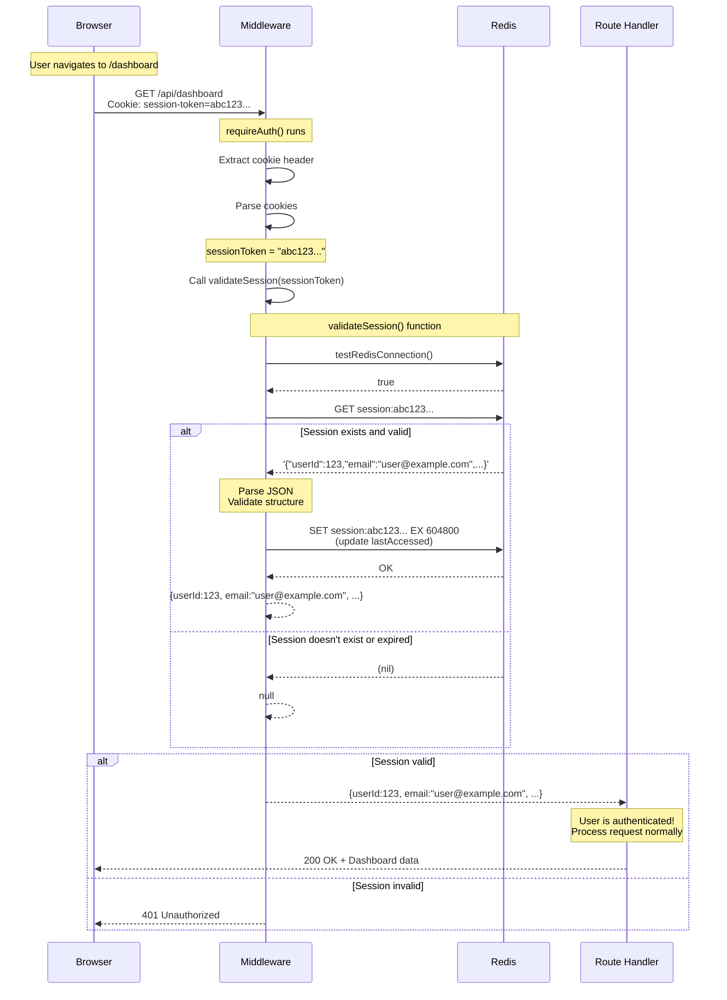

# Session Validation: How Server Knows It's You (Deep Dive)

## The Core Question

> "We create a session... how does the server validate it?"

Let's trace through **exactly what happens** when the server receives a request with a session cookie.

---

## The Complete Validation Process

### Step 1: Request Arrives at Server

When you navigate to `/dashboard`, here's what your browser sends:

```http
GET /api/dashboard HTTP/1.1
Host: localhost:3000
Cookie: session-token=abc123def4567890123456789012345678901234567890123456789012345678901234567
```

**Key Point:** The `Cookie` header is automatically added by your browser. You didn't write code to send it - it just happens!

### Step 2: Middleware Intercepts Request

The middleware function in [`middleware.ts`](src/BACKEND/auth/middleware.ts:4-23) runs BEFORE your route handler:

```typescript
export const requireAuth = async (request: Request): Promise<{...} | Response> => {
  // Step 2a: Extract cookie header from request
  const cookieHeader = request.headers.get("cookie");
  // cookieHeader = "session-token=abc123def456..."
  
  if (!cookieHeader) {
    return createErrorResponse("Unauthorized: No session cookie", 401, getSecurityHeaders());
  }
  
  // Step 2b: Parse cookies to extract session-token
  const cookies = parseCookies(cookieHeader);
  // cookies = { "session-token": "abc123def456..." }
  
  const sessionToken = cookies["session-token"];
  // sessionToken = "abc123def456..."
  
  if (!sessionToken) {
    return createErrorResponse("Unauthorized: No session token", 401, getSecurityHeaders());
  }
  
  // Step 2c: Validate the session token against Redis
  const session = await validateSession(sessionToken);
  // This is where the magic happens!
  
  if (!session) {
    return createErrorResponse("Unauthorized: Invalid session", 401, getSecurityHeaders());
  }
  
  // Step 2d: Return session data to route handler
  return session;
  // session = { userId: 123, email: "user@example.com", ... }
};
```

### Step 3: Cookie Parsing

The `parseCookies` function (from [`middleware.ts`](src/BACKEND/auth/middleware.ts:4-13)) extracts the token:

```typescript
const parseCookies = (cookieHeader: string): Record<string, string> => {
  const cookies: Record<string, string> = {};
  
  // Split by semicolon to get individual cookies
  cookieHeader.split(";").forEach(cookie => {
    // "session-token=abc123..." → ["session-token", "abc123..."]
    const [name, value] = cookie.trim().split("=");
    
    if (name && value) {
      cookies[name] = value;
    }
  });
  
  return cookies;
  // Result: { "session-token": "abc123def456..." }
};
```

**What this does:**
- Takes: `"session-token=abc123def456...; other-cookie=value"`
- Returns: `{ "session-token": "abc123def456...", "other-cookie": "value" }`

### Step 4: Redis Lookup (The Core Validation)

Now the `validateSession` function in [`session.ts`](src/BACKEND/auth/session.ts:147-199) does the actual validation:

```typescript
export const validateSession = async (sessionToken: string): Promise<{...} | null> => {
  // Step 4a: Check if Redis is available
  const redisAvailable = await testRedisConnection();
  if (!redisAvailable) {
    return null;  // Can't validate without Redis
  }

  try {
    // Step 4b: Format the Redis key
    const sessionKey = RedisUtils.sessionKey(sessionToken);
    // sessionKey = "session:abc123def456..."
    
    // Step 4c: Look up session data in Redis
    const sessionDataStr = await RedisUtils.get(sessionKey);
    // This queries Redis: GET session:abc123def456...
    
    if (!sessionDataStr) {
      // Session doesn't exist or expired (TTL ran out)
      return null;
    }
    
    // Step 4d: Parse and validate the session data
    let sessionData: SessionData | null = null;
    try {
      sessionData = JSON.parse(sessionDataStr) as SessionData;
      
      // Validate session data structure
      if (!sessionData || 
          typeof sessionData.userId !== 'number' ||
          typeof sessionData.email !== 'string' ||
          typeof sessionData.name !== 'string' ||
          typeof sessionData.emailVerified !== 'boolean' ||
          typeof sessionData.createdAt !== 'string' ||
          typeof sessionData.lastAccessed !== 'string') {
        throw new Error('Invalid session data structure');
      }
    } catch (parseError) {
      console.error("Error parsing session data:", parseError);
      // Clean up malformed session
      await RedisUtils.del(sessionKey);
      return null;
    }
    
    // Step 4e: Update last accessed time (sliding expiration)
    sessionData.lastAccessed = new Date().toISOString();
    const ttl = 7 * 24 * 60 * 60;  // 7 days in seconds
    await RedisUtils.setWithTTL(sessionKey, JSON.stringify(sessionData), ttl);
    
    // Step 4f: Return the session data
    return {
      userId: sessionData.userId,
      email: sessionData.email,
      name: sessionData.name,
      emailVerified: sessionData.emailVerified,
      createdAt: sessionData.createdAt,
    };
  } catch (error) {
    console.error("Error validating session:", error);
    return null;
  }
};
```

### Step 5: Redis Operations (What Actually Happens)

Let's trace the Redis commands:

```bash
# When session was created (during login):
SET session:abc123def456... '{"userId":123,"email":"user@example.com",...}' EX 604800
SADD user_sessions:123 abc123def456...
EXPIRE user_sessions:123 604800

# When validating session:
GET session:abc123def456...
# Returns: '{"userId":123,"email":"user@example.com",...}'

# If valid, update with sliding expiration:
SET session:abc123def456... '{"userId":123,"email":"user@example.com",...,"lastAccessed":"2024-01-15T12:00:00.000Z"}' EX 604800

# If invalid/expired:
GET session:abc123def456...
# Returns: (nil) - doesn't exist or TTL expired
```

**Redis Key Format:**
```
session:{token}      → Session data JSON
user_sessions:{userId} → Set of session tokens for this user
```

---

## Visual Flow Diagram



---

## What Makes a Session Valid?

A session is considered **valid** if ALL of these conditions are met:

| Condition | How It's Checked | What Happens If Failed |
|-----------|------------------|------------------------|
| **Redis is available** | `testRedisConnection()` returns `true` | Returns `null` (401 error) |
| **Session key exists** | `RedisUtils.get(sessionKey)` returns data | Returns `null` (401 error) |
| **Session not expired** | Redis TTL hasn't expired | Redis returns `nil` (401 error) |
| **Data is valid JSON** | `JSON.parse()` succeeds | Malformed data deleted, returns `null` |
| **Data has correct structure** | Type checks pass | Invalid data deleted, returns `null` |

---

## The "Sliding Expiration" Mechanism

This is a clever feature that keeps active users logged in:

### How It Works

```typescript
// When session is created:
await RedisUtils.setWithTTL(sessionKey, JSON.stringify(sessionData), 604800);
// TTL = 7 days from NOW

// When session is validated (every request):
sessionData.lastAccessed = new Date().toISOString();
await RedisUtils.setWithTTL(sessionKey, JSON.stringify(sessionData), 604800);
// TTL = 7 days from NOW (refreshed!)
```

### Example Timeline

```
Day 0:  User logs in
        → Session created with TTL = 7 days
        → Expires: Day 7

Day 3:  User visits dashboard
        → Session validated
        → TTL refreshed to 7 days
        → Expires: Day 10 (not Day 7!)

Day 6:  User visits dashboard again
        → Session validated
        → TTL refreshed to 7 days
        → Expires: Day 13

Day 12: User visits dashboard
        → Session validated
        → TTL refreshed to 7 days
        → Expires: Day 19

Day 20: User stops using app
        → No more requests
        → Session expires on Day 27 (7 days after last activity)
```

**Benefit:** Active users stay logged in indefinitely, inactive users get logged out automatically.

---

## What Happens When Session Is Invalid?

### Case 1: Session Doesn't Exist in Redis

```bash
GET session:abc123def456...
# Returns: (nil)
```

**Result:** `validateSession()` returns `null` → Middleware returns 401 → Browser redirects to login

### Case 2: Session Expired (TTL Ran Out)

```bash
GET session:abc123def456...
# Returns: (nil) - TTL expired, key was auto-deleted
```

**Result:** Same as above - user must login again

### Case 3: Malformed Session Data

```bash
GET session:abc123def456...
# Returns: '{"userId":"not-a-number",...}'  ← Invalid data
```

**Result:** 
```typescript
JSON.parse(sessionDataStr)  // Succeeds (valid JSON)
typeof sessionData.userId !== 'number'  // Fails type check
await RedisUtils.del(sessionKey);  // Delete bad data
return null;  // Return invalid
```

### Case 4: Redis Is Down

```typescript
const redisAvailable = await testRedisConnection();
if (!redisAvailable) {
  return null;  // Can't validate
}
```

**Result:** All requests fail with 401 until Redis is back up

---

## Complete Code Trace: From Request to Response

Let's trace a real request step-by-step with actual values:

### Initial State (After Login)

```redis
# Redis contains:
session:abc123def4567890123456789012345678901234567890123456789012345678901234567 = {
  "userId": 123,
  "email": "john@example.com",
  "name": "John Doe",
  "emailVerified": true,
  "createdAt": "2024-01-15T10:00:00.000Z",
  "lastAccessed": "2024-01-15T10:00:00.000Z"
}
TTL: 604800 seconds (7 days)

user_sessions:123 = {
  "abc123def4567890123456789012345678901234567890123456789012345678901234567"
}
TTL: 604800 seconds
```

### Request Arrives

```http
GET /api/dashboard HTTP/1.1
Host: localhost:3000
Cookie: session-token=abc123def4567890123456789012345678901234567890123456789012345678901234567
```

### Step-by-Step Processing

```typescript
// 1. Middleware: requireAuth()
const cookieHeader = request.headers.get("cookie");
// cookieHeader = "session-token=abc123..."

const cookies = parseCookies(cookieHeader);
// cookies = { "session-token": "abc123..." }

const sessionToken = cookies["session-token"];
// sessionToken = "abc123..."

// 2. Middleware: validateSession()
const session = await validateSession(sessionToken);

// 3. validateSession(): Check Redis
const redisAvailable = await testRedisConnection();
// redisAvailable = true

// 4. validateSession(): Format key
const sessionKey = RedisUtils.sessionKey(sessionToken);
// sessionKey = "session:abc123..."

// 5. validateSession(): Redis GET
const sessionDataStr = await RedisUtils.get(sessionKey);
// sessionDataStr = '{"userId":123,"email":"john@example.com",...}'

// 6. validateSession(): Parse JSON
let sessionData: SessionData | null = null;
sessionData = JSON.parse(sessionDataStr) as SessionData;
// sessionData = { userId: 123, email: "john@example.com", ... }

// 7. validateSession(): Validate structure
if (!sessionData || typeof sessionData.userId !== 'number' || ...)
// All checks pass!

// 8. validateSession(): Update lastAccessed
sessionData.lastAccessed = new Date().toISOString();
// sessionData.lastAccessed = "2024-01-15T11:30:00.000Z"

// 9. validateSession(): Refresh TTL
await RedisUtils.setWithTTL(sessionKey, JSON.stringify(sessionData), 604800);
// Redis: SET session:abc123... EX 604800
// New expiry: 7 days from NOW (not from creation)

// 10. validateSession(): Return session data
return {
  userId: sessionData.userId,      // 123
  email: sessionData.email,        // "john@example.com"
  name: sessionData.name,          // "John Doe"
  emailVerified: sessionData.emailVerified,  // true
  createdAt: sessionData.createdAt,  // "2024-01-15T10:00:00.000Z"
};

// 11. Middleware: Pass to route handler
// session = { userId: 123, email: "john@example.com", ... }

// 12. Route handler: Process request
// User is authenticated! Fetch dashboard data...

// 13. Response
return new Response(JSON.stringify(dashboardData), { status: 200 });
```

### Final Response

```http
HTTP/1.1 200 OK
Content-Type: application/json

{
  "user": {
    "id": 123,
    "name": "John Doe",
    "email": "john@example.com",
    "emailVerified": true
  },
  "stats": {
    "totalLogins": 42,
    "lastLogin": "2024-01-15T11:30:00.000Z"
  },
  "message": "Welcome back, John Doe!"
}
```

---

## Why This Is Secure

### 1. Token Never Leaves Redis

```typescript
// Client sends: "session-token=abc123..."
// Server looks up: session:abc123... in Redis
// Redis returns: { userId: 123, email: "john@example.com", ... }

// Client NEVER sees:
// - userId: 123
// - email: "john@example.com"
// - Any other session data
```

**Benefit:** Client can't tamper with session data (it's server-side)

### 2. Token is Cryptographically Random

```typescript
const sessionToken = randomBytes(32).toString("hex");
// 32 bytes = 256 bits of entropy
// 64-character hex string
// 16^64 possible combinations = ~10^77
```

**Benefit:** Impossible to guess or brute force

### 3. Token is Short-Lived

```typescript
const ttl = 7 * 24 * 60 * 60;  // 7 days
```

**Benefit:** If token is stolen, it's only valid for 7 days

### 4. Token is Bound to Session

```redis
session:abc123... = { userId: 123, ... }
```

**Benefit:** Token can only be used for this specific session

---

## Common Questions

### Q: Can someone steal my session token?

**A:** Only if:
- They have XSS access to your browser (but `HttpOnly` prevents this)
- They intercept your network traffic (use HTTPS to prevent)
- They have physical access to your device

### Q: What happens if I clear my cookies?

**A:** You're logged out immediately. The server still has your session in Redis, but you can't access it without the cookie.

### Q: Can I have multiple sessions?

**A:** Yes, up to 5 concurrent sessions per user. Each device gets its own token.

### Q: What if Redis restarts?

**A:** All sessions are lost unless you have Redis persistence configured (AOF or RDB). Configure persistence for production.

### Q: How does the server know WHICH user it is?

**A:** The session data in Redis contains `userId`. When the session is validated, this `userId` is returned and used to fetch user-specific data.

---

## Summary

### The Validation Process in One Sentence

> The server extracts the session token from the request cookie, looks it up in Redis, validates the data structure, refreshes the expiration time, and returns the user's ID and information if the session is valid.

### Key Points

1. **Cookie is automatic** - Browser sends it on every request
2. **Redis is the source of truth** - Session data lives there
3. **Validation is simple** - Just a key lookup in Redis
4. **Sliding expiration** - Active users stay logged in
5. **Server-side storage** - Client can't tamper with data

The validation is essentially: **"Does this token exist in Redis? If yes, who does it belong to?"**
